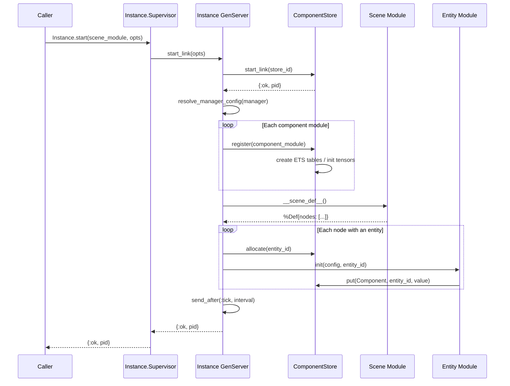
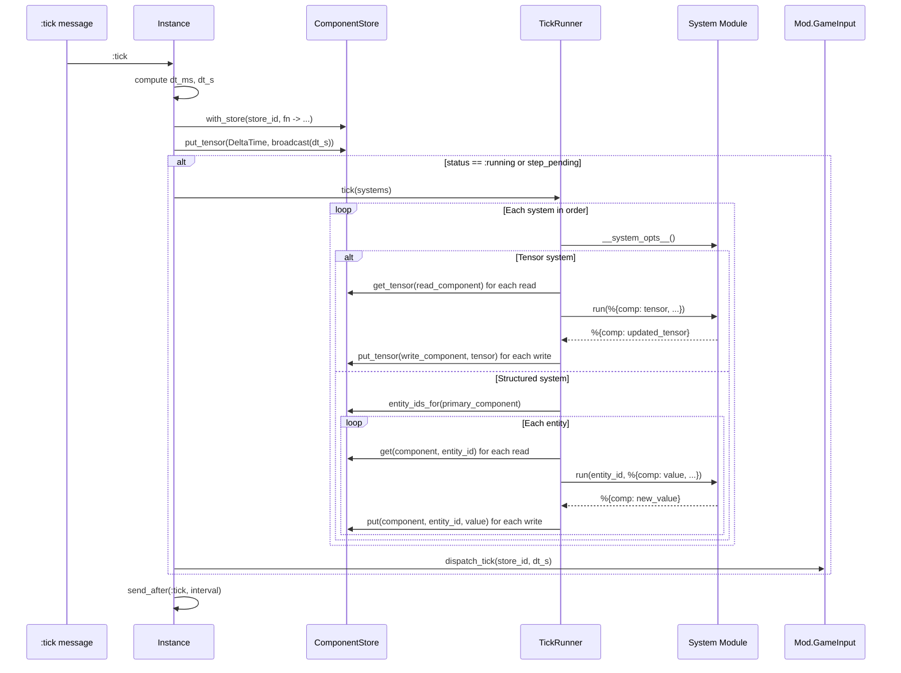
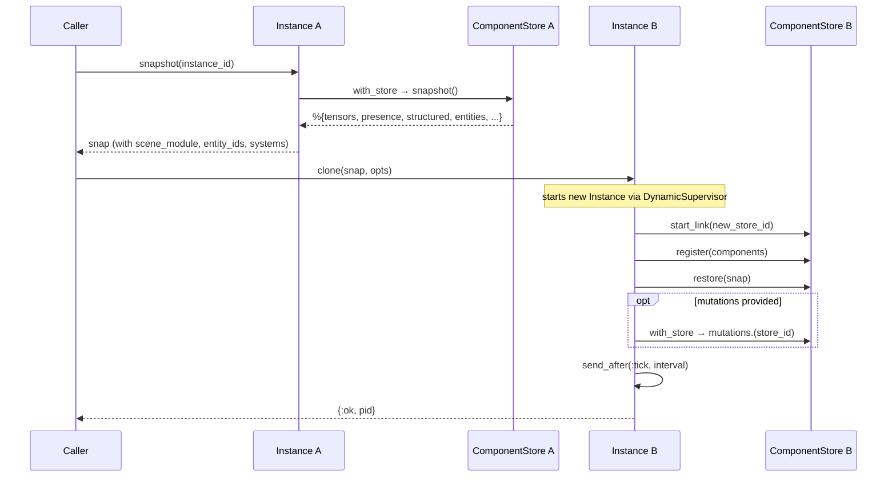

# ECS Core

The ECS ([Entity](../concepts.md#entity)-[Component](../concepts.md#component)-[System](../concepts.md#system))
core is the foundation of Lunity's game state management. It provides two
flavours of component storage -- [Nx](../concepts.md#nx--defn) tensors for
high-throughput numeric data and [ETS](../concepts.md#ets) tables for
arbitrary Elixir terms -- a declarative system pipeline driven by `@spec`
annotations, and an [instance](../concepts.md#instance) model that gives
each running game its own isolated store and [tick](../concepts.md#tick) loop.

## Modules

| Module | File | Role |
|--------|------|------|
| `Lunity.Component` | `lib/lunity/component.ex` | Behaviour and macros for defining tensor and structured components |
| `Lunity.ComponentStore` | `lib/lunity/component_store.ex` | GenServer that owns per-instance ETS tables, entity registry, and tensor storage ([concept](../concepts.md#componentstore)) |
| `Lunity.Entity` | `lib/lunity/entity.ex` | Behaviour for entity types with property schemas and `init/2` |
| `Lunity.EntityFactory` | `lib/lunity/entity_factory.ex` | Creates entities from config files (list of component structs) |
| `Lunity.System` | `lib/lunity/system.ex` | Behaviour for tick-driven systems; reads/writes derived from `@spec` |
| `Lunity.Manager` | `lib/lunity/manager.ex` | Game-level config registry: component list, system list, tick rate ([concept](../concepts.md#manager)) |
| `Lunity.Instance` | `lib/lunity/instance.ex` | GenServer managing one game instance's lifecycle, store, and tick scheduling |
| `Lunity.TickRunner` | `lib/lunity/tick_runner.ex` | Runs the system pipeline for a single tick |

## How It Works

### Component storage

Every component module `use`s `Lunity.Component` with either `storage: :tensor`
or `storage: :structured`. The macro generates the standard CRUD functions
(`get/1`, `put/2`, `remove/1`, `exists?/1`) that delegate to `ComponentStore`,
keyed by the calling module.

**Tensor components** are contiguous Nx tensors with one row per entity slot.
A Position component with `shape: {3}, dtype: :f32` produces a `{capacity, 3}`
tensor of 32-bit floats. A separate `:u8` [presence mask](../concepts.md#presence-mask) tracks which
indices actually hold entities. Tensor components also expose `tensor/0` and
`put_tensor/1` for batch access, which is what tensor systems use.

**Structured components** get their own ETS `:set` table keyed by entity ID.
An optional `index: true` flag creates a secondary `:bag` table for
value-based lookups via `search/1`.

### Entity registry

`ComponentStore` maintains three ETS tables that map between entity IDs
(atoms like `:ball`) and integer tensor indices:

- `lunity_registry_{id}` -- `entity_id -> index`
- `lunity_reverse_{id}` -- `index -> entity_id`
- `lunity_meta_{id}` -- `component_module -> opts`

When the capacity is exhausted, all tensors and presence masks are grown by
concatenating zero-padded slabs, doubling the capacity.

### Store context

The active store is held in the process dictionary under `:lunity_store`.
`ComponentStore.with_store/2` sets it for the duration of a function call.
All component operations resolve the store implicitly, so game code --
entity init, systems, Lua mods -- never needs to pass a store ID explicitly.

### Systems

A system module `use`s `Lunity.System` with `type: :tensor` or
`type: :structured`. The framework reads the `@spec` on `run` at compile
time to determine which components it reads and writes. Map keys must follow
the naming convention: the last segment of the module name, underscored
(e.g. `Pong.Components.Position` becomes `:position`).

**Tensor systems** define `run/1` with [`defn`](../concepts.md#nx--defn) (Nx numerical definitions).
The `TickRunner` builds an input map of raw tensors, calls `run/1`, and
writes the returned tensors back.

**Structured systems** define `run/2` receiving `(entity_id, inputs)`.
The `TickRunner` iterates entities that have the primary read component
and calls `run/2` for each, skipping entities where any input is `nil`.

### Manager

The game defines a single Manager module (e.g. `Pong.Manager`) that
implements `components/0`, `systems/0`, and optionally `tick_rate/0`
and `setup/0`. The Manager is a configuration registry only -- it does
not own any game state. Instances read from the Manager at startup.

### Instance lifecycle

`Lunity.Instance` is a GenServer started under `Lunity.Instance.Supervisor`
(a DynamicSupervisor). On init it:

1. Starts a `ComponentStore` for its `store_id` (equal to the instance ID).
2. Registers all components from the Manager (always including `DeltaTime`).
3. Either restores from a snapshot or walks the scene definition to allocate
   entities and call each entity module's `init/2`.
4. Schedules the first `:tick` message.

Each tick, the Instance computes delta time, updates the `DeltaTime` tensor,
and -- if running or stepping -- calls `TickRunner.tick(systems)` inside
`ComponentStore.with_store/2`, then dispatches to the Lua mod event bus.

### Snapshot and clone

`Instance.snapshot/1` captures the full store state (tensors, presence masks,
structured data, entity registry, GenServer state) into a serialisable map.
`Instance.clone/2` creates a new instance from a snapshot, optionally
applying mutations (e.g. re-seeding random keys).

`run_until/3` and `run_ticks/2` run ticks synchronously for testing and
deterministic simulation.

## Instance Startup

## Tick Cycle

## Snapshot and Clone

## Cross-references

- [Scene and Prefab Loading](02_scene_and_prefab.md) -- scene definitions that provide the entity graph for instance startup
- [Physics](03_physics.md) -- tensor systems and components that plug into the tick pipeline
- [Input](04_input.md) -- `SessionMeta.instance_id` binds input sessions to instances
- [Mod System](07_mod_system.md) -- `Mod.GameInput.dispatch_tick` runs after each tick; `RuntimeAPI` reads/writes components
- [Application Lifecycle](11_application_lifecycle.md) -- supervision tree that hosts Instance.Supervisor and ComponentStore.Registry
