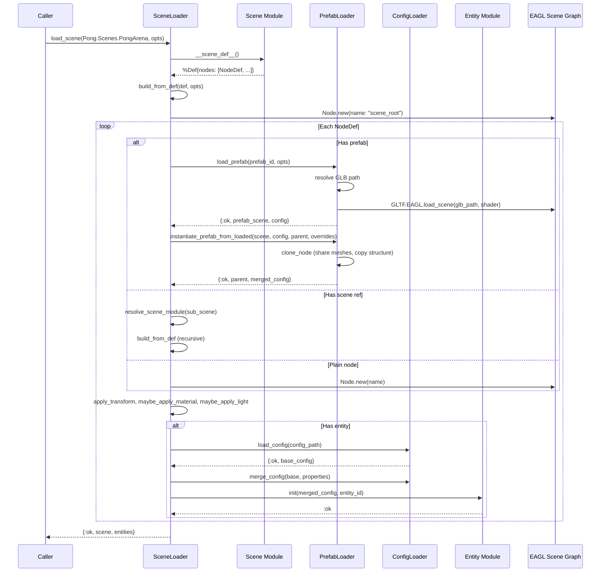
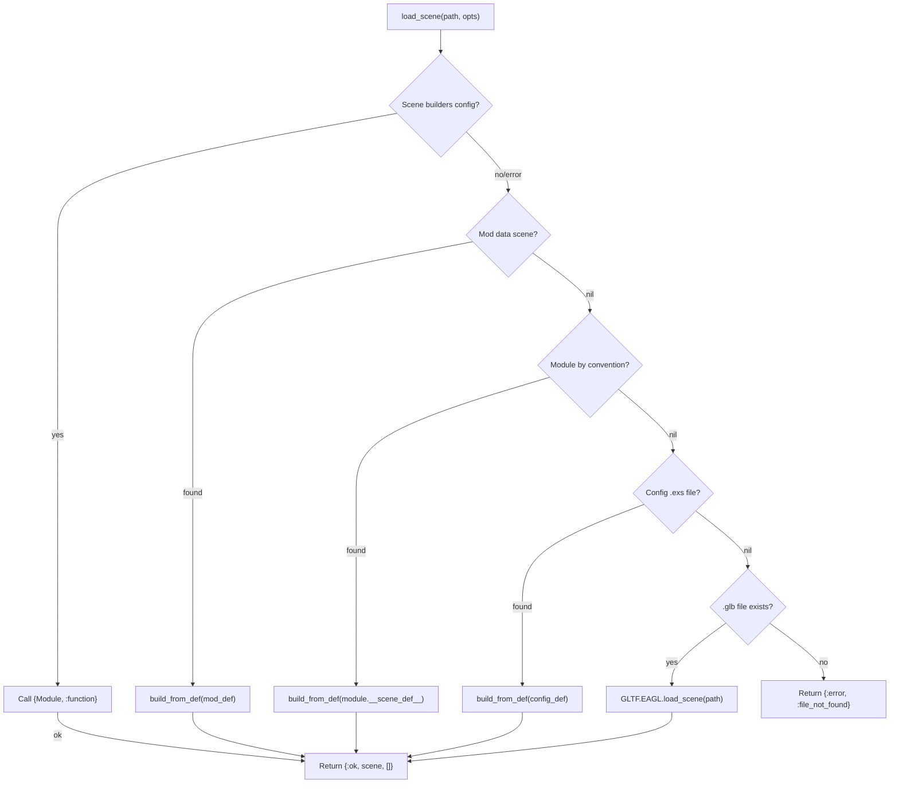
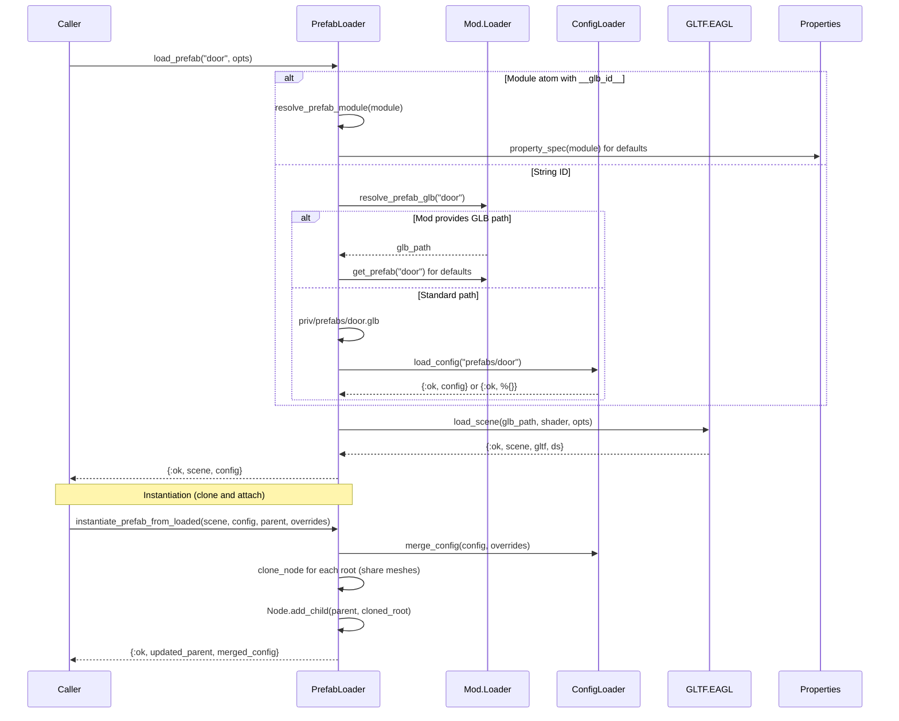

# Scene and Prefab Loading

[Scenes](../concepts.md#scene) and [prefabs](../concepts.md#prefab) define
the spatial layout of a game world. A scene is a tree of nodes -- each with
optional transforms, prefab geometry, [entity](../concepts.md#entity)
bindings, materials, and lights. Prefabs are reusable visual assets
([GLB](../concepts.md#glb--gltf) files) with typed properties. The loading
pipeline resolves scenes from multiple sources (compiled modules, Lua
[mod](../concepts.md#mod) data, config files, raw `.glb`), builds an
[EAGL](../concepts.md#eagl) scene graph, and initialises ECS entities along
the way.

## Modules

| Module | File | Role |
|--------|------|------|
| `Lunity.Scene` | `lib/lunity/scene/scene.ex` | `use Lunity.Scene` macro; generates `__scene_def__/0` at compile time |
| `Lunity.Scene.Def` | `lib/lunity/scene/dsl.ex` | Struct holding a list of `NodeDef`s |
| `Lunity.Scene.NodeDef` | `lib/lunity/scene/dsl.ex` | Struct for a single node: name, prefab, entity, transform, material, light, children |
| `Lunity.Scene.DSL` | `lib/lunity/scene/dsl.ex` | `scene`, `node`, `light` macros for declarative scene definitions |
| `Lunity.SceneLoader` | `lib/lunity/scene_loader.ex` | Entry point for scene resolution and EAGL scene graph construction |
| `Lunity.Prefab` | `lib/lunity/prefab.ex` | `use Lunity.Prefab` macro; links a module to a `.glb` and typed properties |
| `Lunity.PrefabLoader` | `lib/lunity/prefab_loader.ex` | Loads GLB + config for prefabs; instantiates (clones) into a parent node |
| `Lunity.ConfigLoader` | `lib/lunity/config_loader.ex` | Loads `.exs` config files from `priv/config/`; merges with instance properties |
| `Lunity.Properties` | `lib/lunity/properties.ex` | Shared property DSL, compile-time struct generation, runtime validation |

## How It Works

### Scene DSL

A scene is defined with `use Lunity.Scene` and a `scene do ... end` block.
Inside the block, `node` and `light` calls declare the tree:

```elixir
defmodule Pong.Scenes.PongArena do
  use Lunity.Scene

  scene do
    node :floor, prefab: Pong.Prefabs.Box, position: {0, 0, -1}, scale: {12, 6, 0.3}
    node :ball,  prefab: Pong.Prefabs.Box, entity: Pong.Ball,
                 position: {0, 0, 0.5}, scale: {0.4, 0.4, 0.4}
    light :sun,  type: :directional, intensity: 2.0, rotation: {-0.38, 0, 0, 0.92}
  end
end
```

At compile time this produces a `__scene_def__/0` function returning
`%Lunity.Scene.Def{nodes: [...]}`. The same DSL works in `.exs` config files
(evaluated at runtime, returning the struct directly).

Scenes can compose other scenes via `scene:` on a node -- the referenced
module's `__scene_def__` is inlined as a subtree under a group node.

### NodeDef fields

Each `NodeDef` carries optional fields that control what the loader does with
it:

- `prefab:` -- load a GLB visual asset from `priv/prefabs/`
- `entity:` -- bind an entity module; its `init/2` is called during loading
- `config:` -- path to a `.exs` config file for entity defaults
- `properties:` -- per-instance overrides merged on top of config defaults
- `material:` / `light:` -- inline visual overrides
- `position:`, `scale:`, `rotation:` -- local transform
- `scene:` -- sub-scene composition (mutually exclusive with `prefab:`)
- `children:` -- nested nodes

### Scene resolution pipeline

`SceneLoader.load_scene/2` tries sources in order:

1. **Scene builders** -- explicit `{Module, :function}` registered in
   `:lunity, :scene_builders` config.
2. **Mod data** -- `%Def{}` from Lua mods via `data:extend()`.
3. **Module convention** -- `{App}.Scenes.{CamelizedPath}` (e.g. path
   `"pong_arena"` resolves to `Pong.Scenes.PongArena`).
4. **Config file** -- `priv/config/scenes/<path>.exs` returning a `%Def{}`.
5. **GLB file** -- `priv/scenes/<path>.glb` loaded directly via GLTF.EAGL.

The first source that succeeds wins. Path traversal (`..`, absolute paths)
is rejected at every level.

### Prefabs

A prefab module links a `.glb` file to typed properties:

```elixir
defmodule Pong.Prefabs.Box do
  use Lunity.Prefab, glb: "box"

  prefab do
    property :color, :float_array, length: 4, default: [1, 1, 1, 1]
  end
end
```

`PrefabLoader.load_prefab/2` resolves the GLB path (`priv/prefabs/<id>.glb`)
and optional config (`priv/config/prefabs/<id>.exs`). It can also resolve
mod-defined prefabs via `Mod.Loader`. The loader returns an EAGL scene and a
config map.

`instantiate_prefab/4` clones the loaded scene graph (sharing mesh data) and
attaches the roots under a parent node, merging config overrides.

### ConfigLoader

`.exs` files under `priv/config/` are evaluated with `Code.eval_file/1`.
The result (map or keyword list) is normalised to a map with atom keys.
`merge_config/2` combines a base config with instance properties -- `nil`
values in properties are ignored (they don't override the base).

### Properties

`Lunity.Properties` is the shared foundation for both Entity and Prefab
property declarations. The `property/3` macro accumulates property metadata
at compile time. `__before_compile__` in Entity/Prefab consumes these to
generate:

- A struct with defaults
- `__property_spec__/0` for runtime introspection
- A `@type t` typespec

At runtime, `from_config/2` builds a struct from a merged config map, and
`validate_properties/2` checks values against type/min/max/values/length
constraints.

## Scene Loading (from compiled module)



## Scene Resolution Pipeline



## Prefab Loading and Instantiation



## Cross-references

- [ECS Core](01_ecs_core.md) -- `Instance.init_scene_entities` walks scene definitions to allocate entities and call `init/2`
- [Mod System](07_mod_system.md) -- `DataStage` produces scene and prefab definitions via `data:extend()`; `Mod.Loader` provides them to SceneLoader and PrefabLoader
- [Editor](08_editor.md) -- the editor View uses SceneLoader for load/watch commands; FileWatcher triggers reloads on `priv/` changes
- [MCP Tooling](09_mcp_tooling.md) -- `scene_load` tool calls SceneLoader; `BlenderExtras` reads prefab property specs
