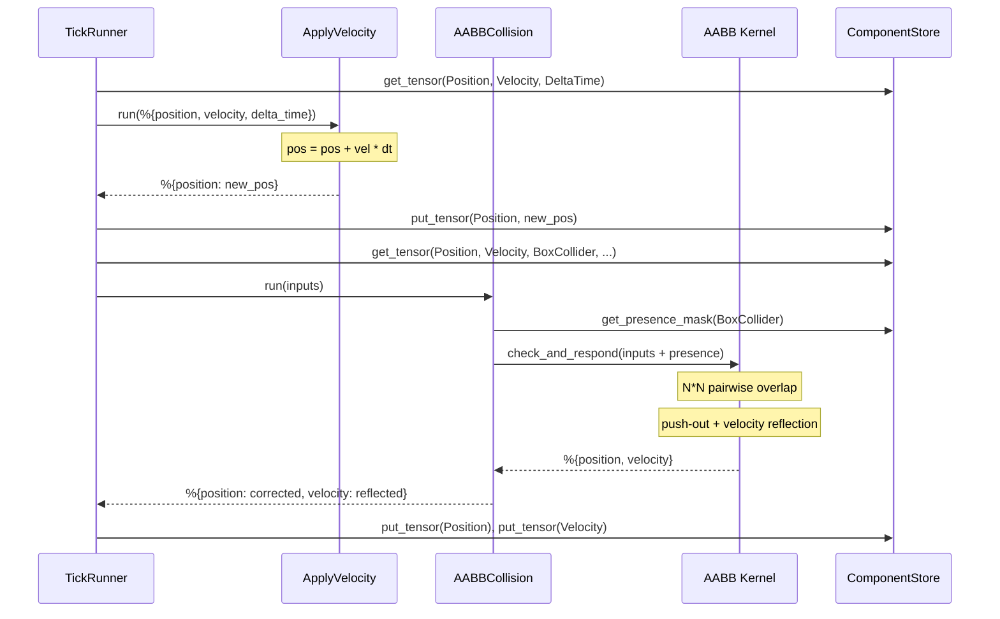
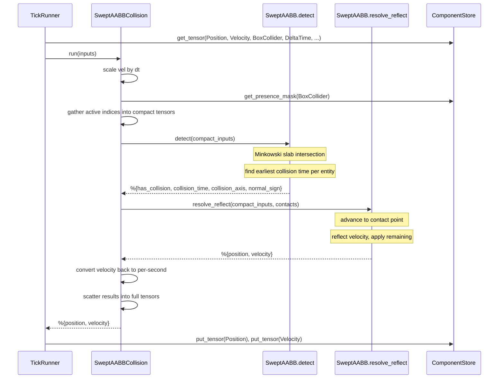
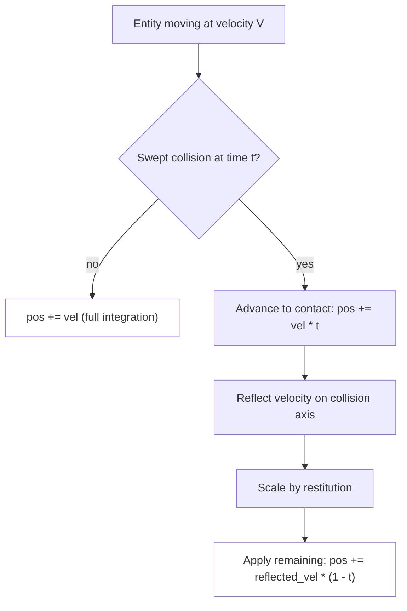

# Physics

The physics subsystem provides [AABB](../concepts.md#aabb)-based collision
detection and response as tensor [systems](../concepts.md#system) that plug
directly into the ECS [tick](../concepts.md#tick) pipeline. Two collision
strategies are available: discrete AABB overlap checks for simple cases, and
swept AABB ray-casting for high-velocity scenarios where tunneling must be
prevented. All collision math runs through [`Nx.Defn`](../concepts.md#nx--defn)
for batch processing on the full [entity](../concepts.md#entity) set each tick.

## Modules

| Module | File | Role |
|--------|------|------|
| `Lunity.Physics.Collision.AABB` | `lib/lunity/physics/collision/aabb.ex` | N-by-N pairwise overlap detection with push-out and velocity reflection (`defn`) |
| `Lunity.Physics.Collision.SweptAABB` | `lib/lunity/physics/collision/swept_aabb.ex` | Ray-cast along movement paths; split into `detect/1` and `resolve_reflect/2` (`defn`) |
| `Lunity.Physics.Systems.ApplyVelocity` | `lib/lunity/physics/systems/apply_velocity.ex` | Tensor system: integrates velocity into position scaled by delta time |
| `Lunity.Physics.Systems.AABBCollision` | `lib/lunity/physics/systems/aabb_collision.ex` | Tensor system: wraps `AABB.check_and_respond/1` with presence mask |
| `Lunity.Physics.Systems.SweptAABBCollision` | `lib/lunity/physics/systems/swept_aabb_collision.ex` | Tensor system: gathers active entities, runs swept detect + resolve, scatters back |
| `Lunity.Physics.Components.Velocity` | `lib/lunity/physics/components/velocity.ex` | Tensor component `{3}` f32 -- per-entity velocity vector |
| `Lunity.Physics.Components.BoxCollider` | `lib/lunity/physics/components/box_collider.ex` | Tensor component `{3}` f32 -- AABB half-extents (or full size for swept) |
| `Lunity.Physics.Components.Static` | `lib/lunity/physics/components/static.ex` | Tensor component `{}` u8 -- 1 = immovable, 0 = dynamic |
| `Lunity.Physics.Components.Restitution` | `lib/lunity/physics/components/restitution.ex` | Tensor component `{}` f32 -- bounciness (0.0 = no bounce, 1.0 = full) |
| `Lunity.Physics.Components.CollisionLayer` | `lib/lunity/physics/components/collision_layer.ex` | Tensor component `{}` s32 -- bitmask identifying which layer an entity is on |
| `Lunity.Physics.Components.CollisionMask` | `lib/lunity/physics/components/collision_mask.ex` | Tensor component `{}` s32 -- bitmask identifying which layers an entity collides with |

## How It Works

### Components

Physics uses six tensor [components](../concepts.md#component), all registered
via the game's [Manager](../concepts.md#manager) alongside `Position` and
`DeltaTime`:

- **Velocity** -- 3D direction and speed per tick (or per second when
  combined with delta time).
- **BoxCollider** -- [axis-aligned bounding box](../concepts.md#aabb) half-extents.
- **Static** -- marks entities that do not move when pushed (walls, floors).
- **Restitution** -- bounce factor applied on velocity reflection.
- **CollisionLayer / CollisionMask** -- bitmask pair for selective collision.
  Entity A collides with entity B if `A.mask & B.layer != 0` (or vice versa).

### Discrete AABB pipeline

For games where entities move slowly relative to their size, the discrete
pipeline is sufficient:

1. **ApplyVelocity** -- `pos += vel * dt` for all entities.
2. **AABBCollision** -- calls `AABB.check_and_respond/1`.

The AABB kernel:

1. Broadcasts positions and extents to `{N, 1, 3}` and `{1, N, 3}` to form
   all N-by-N pairwise differences.
2. Computes per-axis overlap: `sum_extents - |pos_i - pos_j|`.
3. Filters by presence mask, self-collision, and layer/mask compatibility.
4. Finds the minimum-overlap axis (collision normal) per pair.
5. Computes push-out along the normal; only dynamic entities are moved.
6. Reflects velocity on the collision axis, scaled by restitution.

### Swept AABB pipeline

For high-velocity entities (e.g. a fast-moving ball), swept collision
prevents tunneling by ray-casting the velocity vector:

1. **SweptAABBCollision** (single system, replaces both ApplyVelocity and
   AABBCollision).

The system:

1. Scales velocity by delta time to get per-tick displacement.
2. Gathers only active entities (presence mask = 1) into compact tensors.
3. Calls `SweptAABB.detect/1` -- Minkowski-expanded slab intersection to find
   the earliest collision time `t` in `[0, 1]` for each entity.
4. Calls `SweptAABB.resolve_reflect/2` -- advances to the collision point
   (`pos + vel * t`), reflects velocity, then applies remaining movement
   (`pos += reflected_vel * (1 - t)`).
5. Scatters results back into the full-capacity tensors.

The detect/resolve split allows future resolvers (e.g. a rigid body solver)
to reuse the same contact data.

### Layer/mask filtering

Both kernels evaluate collision compatibility symmetrically:

```
collides = (mask_i & layer_j != 0) OR (mask_j & layer_i != 0)
```

This means a wall on layer 1 will collide with a ball whose mask includes
layer 1, even if the wall's own mask is 0 (walls don't care about anything,
but things care about walls).

## Discrete AABB Tick



## Swept AABB Tick



## Collision Response Detail



## Cross-references

- [ECS Core](01_ecs_core.md) -- physics systems and components participate in the tick pipeline via Manager registration
- [Scene and Prefab](02_scene_and_prefab.md) -- entity `init/2` sets initial velocity, collider extents, and collision layers
- [Mod System](07_mod_system.md) -- Lua mods can read positions and velocities via the runtime API after physics has run
