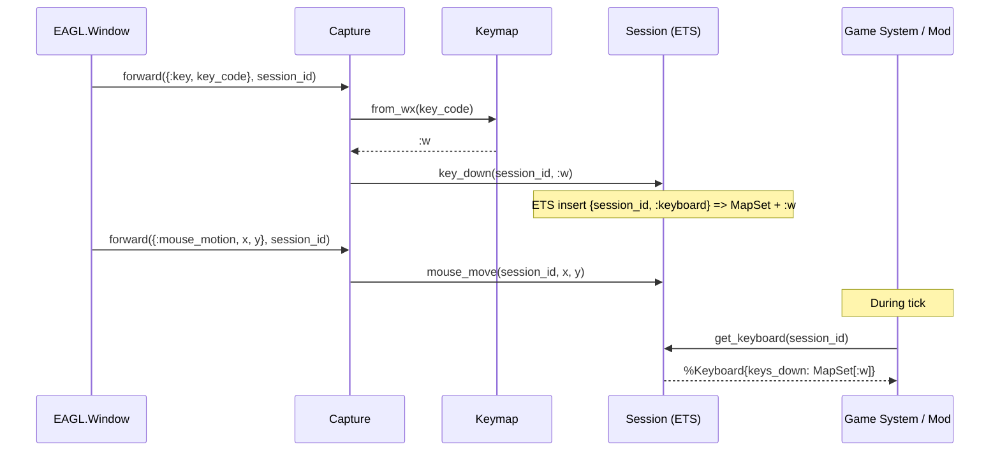
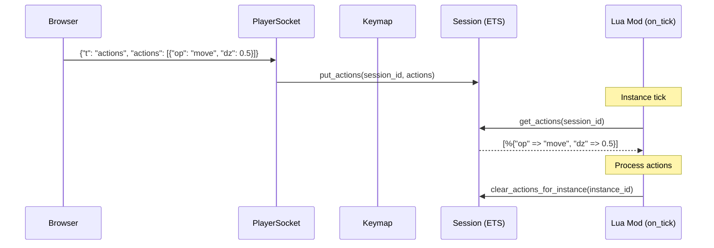
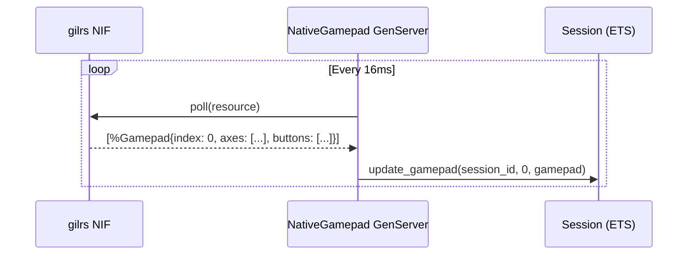

# Input

The input subsystem provides a unified, [session](../concepts.md#session)-based
input model for keyboard, mouse, gamepad, head tracking, and semantic game
actions. All input state is stored in a single [ETS](../concepts.md#ets)
table with direct reads and writes -- no GenServer on the hot path. Input
arrives from three backends: native [EAGL](../concepts.md#eagl) window events
(via Capture), browser WebSocket messages (via PlayerSocket), and Rustler
[NIF](../concepts.md#nif) polling (for gamepads and TrackIR). Game
[systems](../concepts.md#system) and Lua [mods](../concepts.md#mod) read the
same Session API regardless of the input source.

## Modules

| Module | File | Role |
|--------|------|------|
| `Lunity.Input.Session` | `lib/lunity/input/session.ex` | Direct ETS reads/writes for all input state per session |
| `Lunity.Input.SessionManager` | `lib/lunity/input/session_manager.ex` | GenServer that owns the `:lunity_input` ETS table (lifecycle only) |
| `Lunity.Input.SessionMeta` | `lib/lunity/input/session_meta.ex` | Struct: `user_id`, `player_id`, `instance_id`, `entity_id`, `spawn`, `mapping` |
| `Lunity.Input.Keyboard` | `lib/lunity/input/keyboard.ex` | Struct: `keys_down` MapSet of canonical key atoms |
| `Lunity.Input.Mouse` | `lib/lunity/input/mouse.ex` | Struct: position, button states, wheel delta |
| `Lunity.Input.Gamepad` | `lib/lunity/input/gamepad.ex` | Struct: W3C Gamepad API-style axes and buttons |
| `Lunity.Input.HeadPose` | `lib/lunity/input/head_pose.ex` | Struct: 6-DOF (yaw, pitch, roll, x, y, z, frame) |
| `Lunity.Input.Keymap` | `lib/lunity/input/keymap.ex` | Maps WX keycodes and JS `KeyboardEvent.code` to canonical atoms |
| `Lunity.Input.ControlBinding` | `lib/lunity/input/control_binding.ex` | Maps Lua/JSON key name strings to `Keyboard.key()` atoms |
| `Lunity.Input.Capture` | `lib/lunity/input/capture.ex` | Forwards EAGL.Window events to Session ETS |
| `Lunity.Input.NativeGamepad` | `lib/lunity/input/native_gamepad.ex` | GenServer polling gilrs via Rustler NIF, writes to Session |
| `Lunity.Input.NativeTrackIR` | `lib/lunity/input/native_trackir.ex` | GenServer polling TrackIR SDK (Windows), writes HeadPose to Session |

## How It Works

### ETS-based session store

All input state lives in the `:lunity_input` ETS table (`:public`, `:set`,
`:named_table`), owned by `SessionManager`. The table uses composite keys:

```
{session_id, :keyboard}        => %Keyboard{}
{session_id, :mouse}           => %Mouse{}
{session_id, :gamepad, index}  => %Gamepad{}
{session_id, :head_pose}       => %HeadPose{}
{session_id, :actions}         => [action_map, ...]
{session_id, :meta}            => %SessionMeta{}
```

`Session.register/2` inserts default rows; `Session.unregister/1` deletes
all rows for a session. The table is `:public` so any process can read or
write without message passing.

### Session metadata

`SessionMeta` binds a session to the game:

- `user_id` / `player_id` -- identity from JWT auth
- `instance_id` -- which game Instance this session targets
- `entity_id` -- which ECS entity the player controls
- `spawn` -- server-assigned spawn data
- `mapping` -- reserved for future control mapping

### Input backends

**Native (EAGL window):** `Capture.forward/2` translates EAGL.Window events
(`:key`, `:key_up`, `:mouse_motion`, `:mouse_down`, etc.) into Session
writes. Key codes pass through `Keymap.from_wx/1` to canonical atoms.

**Browser (WebSocket):** `PlayerSocket` and `ViewerSocket` receive JSON
input messages (key_down, key_up, mouse_move, gamepad) and call Session
write functions directly. JS key codes pass through `Keymap.from_js/1`.

**Native gamepads:** `NativeGamepad` is a GenServer that polls the gilrs
Rustler NIF every 16ms and writes `%Gamepad{}` structs to Session ETS.

**Native head tracking:** `NativeTrackIR` (Windows only) polls the TrackIR
SDK and writes `%HeadPose{}` to Session ETS.

### Semantic actions

Players send `actions` messages over the WebSocket with a list of semantic
game actions (e.g. `%{"op" => "move", "dz" => 0.5}`). These are stored via
`Session.put_actions/2` and read by Lua mods during `on_tick`.
`Session.clear_actions_for_instance/1` empties action lists for all sessions
bound to an instance after the tick completes.

### Keymap normalisation

`Keymap` maintains two mapping tables:

- `from_wx/1` -- WX integer keycodes (printable ASCII + special WXK_*
  constants) to atoms
- `from_js/1` -- browser `KeyboardEvent.code` strings (e.g. `"KeyW"`,
  `"ArrowUp"`, `"Space"`) to the same atoms

This ensures `:w` is `:w` whether input comes from a native window or a
browser.

### Session lifecycle with reconnect

When a WebSocket disconnects, `PlayerSocket.terminate/3` either unregisters
the session (if no player_id) or registers it with `Player.Resume` for a
grace period. If the same player reconnects within the grace window,
`Session.clone_from/2` copies all input state from the old session to the
new one and unregisters the old session.

## Input Flow (Native Window)



## Input Flow (Browser WebSocket)



## Input Flow (Native Gamepad)



## Cross-references

- [Player Protocol and Auth](05_player_protocol_and_auth.md) -- PlayerSocket registers sessions and delivers `actions` messages
- [Mod System](07_mod_system.md) -- `GameInput.dispatch_tick` passes session/action data to Lua handlers; `RuntimeAPI` reads keyboard/actions via Session
- [ECS Core](01_ecs_core.md) -- `SessionMeta.instance_id` scopes input to a specific game instance
- [Native Extensions](10_native_extensions.md) -- gilrs and TrackIR Rustler NIFs provide the polling backends
- [Editor](08_editor.md) -- editor View uses Capture to forward window events for orbit controls and input testing
