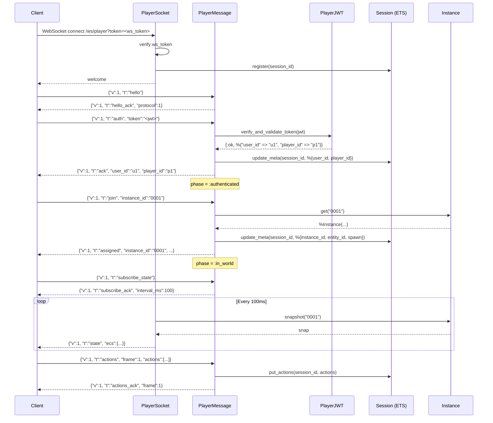
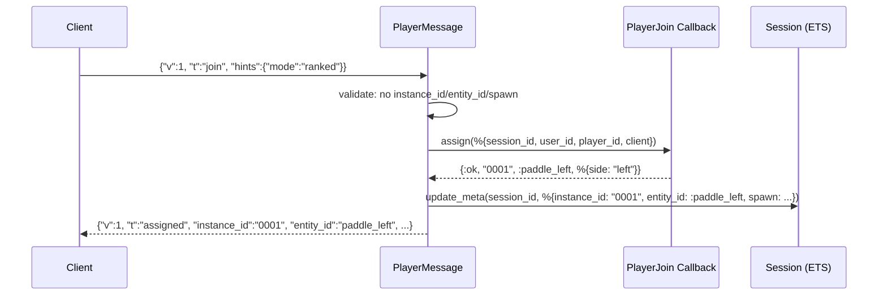
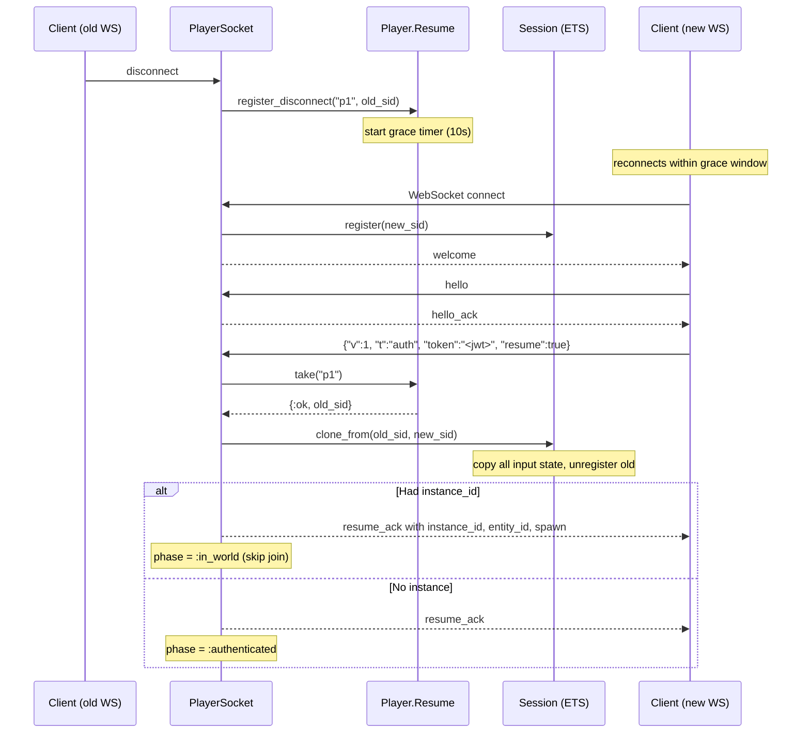

# Player Protocol and Auth

The [player](../concepts.md#player) protocol defines how game clients connect,
authenticate, join game [instances](../concepts.md#instance), send actions,
and receive ECS state over a WebSocket. It uses a two-layer auth model: a
shared secret token for the transport handshake and a
[JWT](../concepts.md#jwt) for user identity. The protocol supports
reconnection with a configurable grace window that preserves the player's
[session](../concepts.md#session) state.

## Modules

| Module | File | Role |
|--------|------|------|
| `Lunity.Web.PlayerSocket` | `lib/lunity/web/player_socket.ex` | Phoenix socket transport at `/ws/player`; handshake, message dispatch, state push timer |
| `Lunity.Web.PlayerMessage` | `lib/lunity/web/player_message.ex` | Protocol handler: parses JSON envelope, implements hello/auth/join/actions/subscribe/leave/ping |
| `Lunity.Web.PlayerWire` | `lib/lunity/web/player_wire.ex` | JSON structure helpers: `resume_ack_map`, `error_map`, `entity_to_wire` |
| `Lunity.Web.PlayerJoin` | `lib/lunity/web/player_join.ex` | Behaviour for server-assigned join callbacks (`assign/1`) |
| `Lunity.Web.PlayerToken` | `lib/lunity/web/player_token.ex` | Plug endpoint to mint player JWTs (dev/trusted backend) |
| `Lunity.Auth.PlayerJWT` | `lib/lunity/auth/player_jwt.ex` | HS256 JWT generation and verification (Joken) |
| `Lunity.Player.Resume` | `lib/lunity/player/resume.ex` | GenServer for reconnect grace: stores pending sessions, times out stale ones |
| `Lunity.Player.WsClient` | `lib/lunity/player/ws_client.ex` | WebSockex-based client implementing the full protocol (for CLI and testing) |
| `Lunity.Player.Connect` | `lib/lunity/player/connect.ex` | Helpers for CLI: resolve WS token, mint JWT, parse hints |
| `Lunity.Player.WsUrl` | `lib/lunity/player/ws_url.ex` | Builds WebSocket URL from base HTTP URL |

## How It Works

### [Wire format](../concepts.md#wire-format)

Every message is a JSON object with a version and type field:

```json
{"v": 1, "t": "hello"}
```

The server always replies with the same envelope. Error responses use
`{"v": 1, "t": "error", "code": "...", "message": "..."}`.

### Auth layers

**Layer 1 -- Transport token:** The WebSocket connection itself requires a
shared secret (`:player_ws_token`) passed as `?token=` query parameter. If
unset or mismatched, the connection is rejected at the Phoenix socket level.
This prevents unauthorized WebSocket connections.

**Layer 2 -- Player JWT:** After the WebSocket is open, the client sends an
`auth` message containing a JWT. The token is HS256-signed with
`:player_jwt_secret` and carries `user_id` (required) and `player_id`
(optional, defaults to user_id). Tokens expire after 1 hour by default.

**JWT minting:** `POST /api/player/token` with header
`X-Player-Mint-Key: <:player_mint_secret>` and body
`{"user_id": "...", "player_id": "..."}` returns `{"token": "<jwt>"}`.
This endpoint is for dev/trusted backends; production games issue JWTs
through their own auth system.

### Protocol phases

The socket progresses through ordered phases:

1. **`:connected`** -- WebSocket open, waiting for `hello`
2. **`:hello_ok`** -- `hello_ack` sent, waiting for `auth`
3. **`:authenticated`** -- JWT verified, can `join`
4. **`:in_world`** -- joined an instance, can send `actions` and
   `subscribe_state`

### Join modes

**Server-assigned:** When `:player_join` is configured as `{Module, :fun}`,
the client sends `join` with only optional `hints`. The callback receives
`%{session_id, user_id, player_id, client}` and returns
`{:ok, instance_id, entity_id, spawn}`. The client cannot specify
`instance_id`, `entity_id`, or `spawn` directly.

**Client-driven:** Without a `:player_join` callback, the client must send
`instance_id` in the `join` message. `entity_id` and `spawn` are optional.
The server verifies the instance exists.

### Actions

Once in-world, the client sends `actions` messages:

```json
{
  "v": 1, "t": "actions", "frame": 42,
  "actions": [{"op": "move", "entity": "paddle_left", "dz": 0.25}]
}
```

Actions are validated (max 64 per frame, each must have a string `op`),
normalised (string lengths capped, numeric values clamped to [-1, 1]),
and stored via `Session.put_actions/2`. The server replies with
`actions_ack`. Actions are consumed and cleared after each tick by the
mod system.

### State subscription

`subscribe_state` starts a timer that pushes ECS snapshots at
`:player_state_push_interval_ms` (default 100ms). Each push captures an
`Instance.snapshot`, normalises it via `EcsState.encode_for_wire` (Nx
tensors to lists, atoms to strings, DateTime to ISO8601), and sends it as a
`state` message. `unsubscribe_state` stops the timer.

### Reconnect / Resume

When a WebSocket disconnects and the session has a `player_id`,
`PlayerSocket.terminate` registers the disconnect with `Player.Resume`.
The session stays alive in ETS for `:player_reconnect_grace_ms` (default
10 seconds).

If the same `player_id` reconnects within the grace window and sends
`auth` with `resume: true`, `Resume.take/1` returns the old session ID.
`Session.clone_from/2` copies all input state to the new session. If the
old session had an `instance_id`, the player resumes in-world immediately
without needing to re-join.

If no reconnect happens within the grace period, the old session is
unregistered and its ETS rows are deleted.

## Full Connection Lifecycle



## Server-Assigned Join



## Reconnect / Resume



## Cross-references

- [Input](04_input.md) -- Session ETS stores all input state; actions flow through Session
- [Web Infrastructure](06_web_infrastructure.md) -- Endpoint mounts PlayerSocket; Router serves the token mint endpoint
- [ECS Core](01_ecs_core.md) -- `Instance.snapshot` provides ECS state for the `state` message
- [Mod System](07_mod_system.md) -- Lua mods consume actions via `GameInput.dispatch_tick`
- [Application Lifecycle](11_application_lifecycle.md) -- `Player.Resume` is started in the supervision tree
