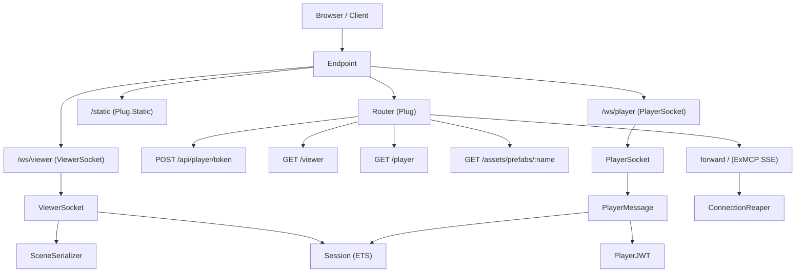
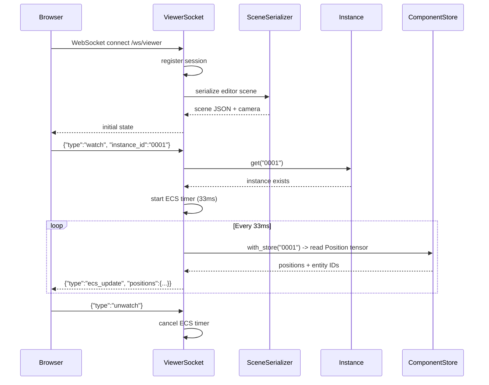

# Web Infrastructure

The web infrastructure provides the HTTP server, WebSocket transports, static
asset serving, and supporting services that underpin the
[player](../concepts.md#player) protocol and scene viewer. It is built on
Phoenix (Bandit) and exposes two WebSocket endpoints, a REST API for
[JWT](../concepts.md#jwt) minting, static file serving, and an SSE transport
for the [MCP](../concepts.md#mcp) server.

## Modules

| Module | File | Role |
|--------|------|------|
| `Lunity.Web.Endpoint` | `lib/lunity/web/endpoint.ex` | Phoenix Endpoint: mounts WebSocket transports, static files, and the router |
| `Lunity.Web.Router` | `lib/lunity/web/router.ex` | Plug router: API routes, HTML pages, prefab assets, MCP forwarding |
| `Lunity.Web.ViewerSocket` | `lib/lunity/web/viewer_socket.ex` | WebSocket for the browser scene viewer (no auth, streams positions at ~30fps) |
| `Lunity.Web.SceneSerializer` | `lib/lunity/web/scene_serializer.ex` | Converts EAGL.Scene to JSON for the WebGL viewer (world matrices, materials, lights) |
| `Lunity.Web.EcsState` | `lib/lunity/web/ecs_state.ex` | Normalises ECS snapshots to JSON-safe terms (tensors to lists, atoms to strings) |
| `Lunity.Web.ConnectionReaper` | `lib/lunity/web/connection_reaper.ex` | GenServer that tracks SSE connection PIDs and kills stale ones after 24 hours |

## How It Works

### Endpoint

The Phoenix Endpoint (`Lunity.Web.Endpoint`) is the entry point for all
HTTP and WebSocket traffic. It mounts:

- **`/ws/viewer`** -- `ViewerSocket` (no auth, `connect_info: [:uri]`)
- **`/ws/player`** -- `PlayerSocket` (auth_token required,
  `connect_info: [:uri, :auth_token]`)
- **`/static`** -- static files from Lunity's own `priv/static/` (player.html,
  player_shell.js, lunity_input.js, viewer.html)
- SSE connection tracking hooks for `/sse` and `/mcp/v1/sse` paths

The endpoint does not start automatically; it is started by `mix lunity.edit`
(for the editor) or by the game's Application when running as a server.

### Router

The Plug router handles:

- `POST /api/player/token` -- delegates to `PlayerToken` for JWT minting
- `GET /viewer` -- serves `viewer.html`
- `GET /player` -- serves `player.html` (game-specific if available)
- `GET /pong` -- serves game-specific HTML (e.g. `pong_gl.html`)
- `GET /assets/prefabs/:name` -- serves `.glb` prefab files from the game
  app's `priv/prefabs/`
- `forward "/"` -- passes remaining requests to the ExMCP HTTP handler

### ViewerSocket

The viewer WebSocket at `/ws/viewer` is an unauthenticated transport for the
browser scene viewer. On connect it:

1. Registers an input session
2. Sends the current editor scene (serialised via `SceneSerializer`) and
   camera state

The viewer supports instance watching:

- **`watch`** -- client sends `{"type": "watch", "instance_id": "..."}`;
  the socket starts streaming ECS positions at ~30fps (33ms interval)
- **`unwatch`** -- stops the position stream
- **`list_instances`** -- returns all running instance IDs

The viewer also forwards keyboard, mouse, and gamepad input from the browser
into the Session ETS table, allowing browser-based input during development.

### SceneSerializer

Converts an EAGL.Scene into a JSON-serialisable structure for the WebGL
viewer. For each node it computes the world matrix (from local transforms)
and outputs: name, world_matrix (4x4 flat), glb_id, has_mesh, material
properties, and light data.

### EcsState

Normalises ECS snapshots for JSON serialisation:

- `Nx.Tensor` values become flat lists
- Atoms become strings
- `DateTime` becomes ISO8601
- Maps are recursively normalised with string keys
- Tuples become lists

Used by both `PlayerMessage` (for `state` pushes) and the MCP `ecs_dump`
tool.

### ConnectionReaper

A GenServer that monitors SSE connections (used by the MCP server). It:

- Tracks connection PIDs in an ETS table with timestamps
- Sweeps every 60 seconds, killing connections older than 24 hours
- Handles normal process exit via monitoring
- Exposes `count/0` and `info/0` for debugging

## Request Flow

## ViewerSocket Instance Watching

## Cross-references

- [Player Protocol and Auth](05_player_protocol_and_auth.md) -- PlayerSocket is mounted by this Endpoint; PlayerToken is routed here
- [MCP Tooling](09_mcp_tooling.md) -- the ExMCP SSE transport is forwarded through the Router; ConnectionReaper manages SSE lifecycle
- [Editor](08_editor.md) -- the viewer page and SceneSerializer serve the editor's browser-based scene viewer
- [Application Lifecycle](11_application_lifecycle.md) -- Endpoint is started by `mix lunity.edit` or the game app
