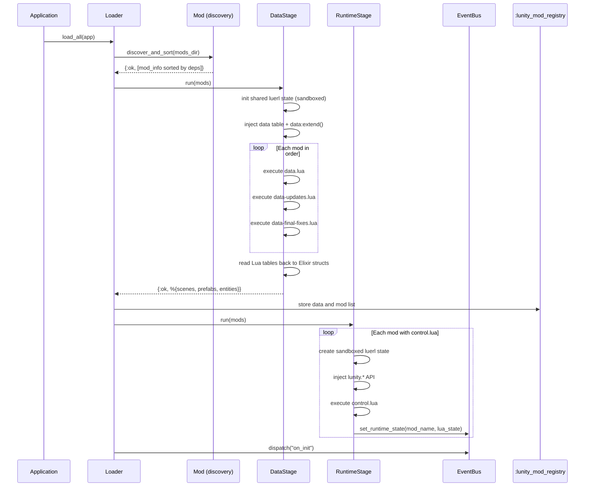
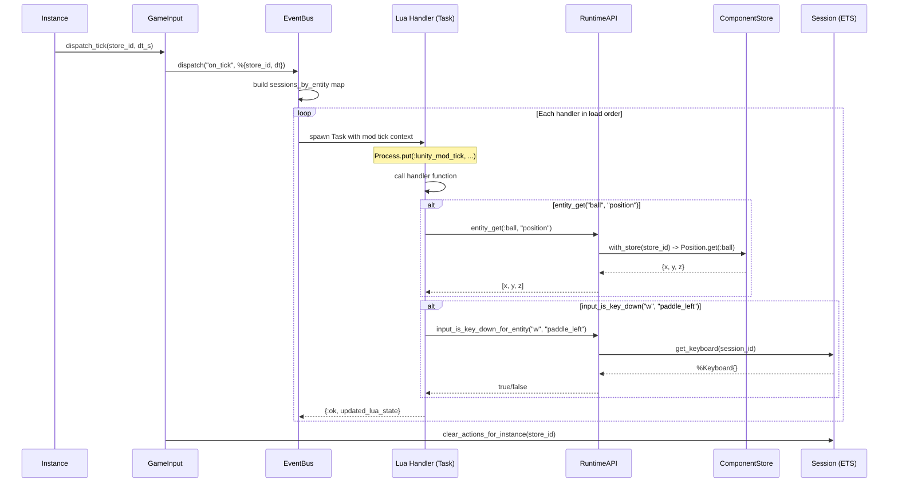

# Mod System (Lua)

The [mod](../concepts.md#mod) system provides Factorio-style modding for
Lunity games using Lua. Mods define game content
([scenes](../concepts.md#scene), [prefabs](../concepts.md#prefab),
[entities](../concepts.md#entity)) in a shared data stage and implement
runtime behaviour (event handlers) in isolated per-mod states. The system
handles mod discovery, dependency resolution, sandboxed execution, and a
synchronous event bus that dispatches engine events to mod handlers during
the [tick](../concepts.md#tick) loop.

## Modules

| Module | File | Role |
|--------|------|------|
| `Lunity.Mod` | `lib/lunity/mod.ex` | Mod discovery, `mod.lua` metadata parsing, topological dependency sort |
| `Lunity.Mod.Loader` | `lib/lunity/mod/loader.ex` | Orchestrates the full load pipeline: discover, data stage, store, runtime stage, `on_init` |
| `Lunity.Mod.DataStage` | `lib/lunity/mod/data_stage.ex` | Shared luerl state; runs `data.lua`, `data-updates.lua`, `data-final-fixes.lua`; reads back scene/prefab/entity definitions |
| `Lunity.Mod.RuntimeStage` | `lib/lunity/mod/runtime_stage.ex` | Per-mod isolated luerl states with `lunity.*` API; executes `control.lua`; wires handlers to EventBus |
| `Lunity.Mod.EventBus` | `lib/lunity/mod/event_bus.ex` | GenServer: handler registration and synchronous event dispatch in mod load order |
| `Lunity.Mod.GameInput` | `lib/lunity/mod/game_input.ex` | Dispatches `on_tick` after each instance tick; clears actions afterward |
| `Lunity.Mod.RuntimeAPI` | `lib/lunity/mod/runtime_api.ex` | Engine bridge: `entity_get/set`, `input_is_key_down_for_entity`, `input_actions_for_entity` |
| `Lunity.Mod.Sandbox` | `lib/lunity/mod/sandbox.ex` | Creates sandboxed luerl states with unsafe globals removed |
| `Lunity.Mod.ResourceLimits` | `lib/lunity/mod/resource_limits.ex` | Instruction counting, timeouts, max state size |

## How It Works

### Mod structure

Each mod lives in `priv/mods/<name>/`:

```
priv/mods/base/
  mod.lua                # metadata: name, version, title, dependencies
  data.lua               # data stage: scene/prefab/entity definitions
  data-updates.lua       # optional: patch other mods' data
  data-final-fixes.lua   # optional: final adjustments
  control.lua            # runtime stage: event handlers
  assets/prefabs/*.glb   # mod-provided GLB files
```

`mod.lua` is executed by luerl and must return a table with `name`,
`version`, `title`, and `dependencies`.

### Load pipeline

`Loader.load_all/1` orchestrates the full sequence:

1. **Discover** -- scan `priv/mods/`, parse each `mod.lua`
2. **Sort** -- topological sort by dependencies (cycle detection)
3. **Data stage** -- shared luerl state, execute data files in order
4. **Store** -- materialised data saved in `:lunity_mod_registry` ETS
5. **Runtime stage** -- per-mod luerl states, execute `control.lua`
6. **`on_init`** -- dispatch initial event to all handlers

### Data stage

A single shared luerl state is created with the `data` table and
`data:extend()` function. Mods call:

```lua
data:extend({
  { type = "scene", name = "pong_arena", nodes = { ... } },
  { type = "prefab", name = "box", glb = "box", ... },
})
```

The three data files are executed per mod in dependency order:
`data.lua` -> `data-updates.lua` -> `data-final-fixes.lua`. After all mods
have run, the Lua tables are read back into Elixir structs
(`%Lunity.Scene.Def{}`, prefab maps, entity maps) and stored in ETS.

`SceneLoader` and `PrefabLoader` query this data via
`Loader.get_scene/1` and `Loader.get_prefab/1`.

### Runtime stage

Each mod gets its own sandboxed luerl state with the `lunity.*` API
injected:

- `lunity.on(event, handler)` -- register event handler
- `lunity.entity.get(id, prop)` -- read entity property
- `lunity.entity.set(id, prop, value)` -- write entity property
- `lunity.input.is_key_down(key, entity)` -- check key state
- `lunity.input.actions(entity)` -- get semantic actions
- `lunity.log(msg)` -- logging

`control.lua` is executed once; any `lunity.on("on_tick", handler)` calls
register the handler with the EventBus. The final luerl state is stored
in the EventBus for use during dispatch.

### Event dispatch

`EventBus.dispatch/2` is a synchronous GenServer call. For each registered
handler (in mod load order):

1. Look up the mod's luerl state
2. Set `Process.put(:lunity_mod_tick, ...)` with `store_id`, `dt`, and
   `sessions_by_entity` (maps entity IDs to session IDs)
3. Call the Lua handler function with a timeout
4. Store the updated luerl state

The synchronous design ensures ECS/input mutations from `on_tick` are
applied before the instance continues the frame.

### GameInput integration

`GameInput.dispatch_tick/2` is called by `Instance` after each tick:

1. Dispatches `"on_tick"` to the EventBus with `%{store_id, dt}`
2. Clears actions for all sessions bound to the instance

This runs only when `:mods_enabled` is `true` and the EventBus is running.

### RuntimeAPI context

When a Lua handler calls `lunity.entity.get(id, "position")`, the
`RuntimeAPI` reads the process dictionary for `:lunity_mod_tick`:

- **In tick context:** reads/writes ComponentStore via `with_store(store_id)`
- **Outside tick:** falls back to Editor.State (scene graph read-only)

`input_is_key_down_for_entity/2` and `input_actions_for_entity/1` use
`sessions_by_entity` to find the session bound to the entity, then read
from Session ETS.

### Sandbox

`Sandbox.new/0` creates a luerl state with unsafe globals removed:
`io`, `os`, `debug`, `load`, `loadfile`, `dofile`, `require`, `rawget`,
`rawset`, `collectgarbage`, etc. Safe standard library functions (`table`,
`string`, `math`, `pairs`, `ipairs`, `type`, `tostring`, `tonumber`,
`select`, `unpack`, `error`, `pcall`, `xpcall`) are preserved.

## Mod Loading Pipeline



## Tick Dispatch



## Cross-references

- [ECS Core](01_ecs_core.md) -- `Instance` calls `GameInput.dispatch_tick` after each tick; RuntimeAPI reads/writes ComponentStore
- [Scene and Prefab](02_scene_and_prefab.md) -- DataStage produces scene and prefab definitions consumed by SceneLoader and PrefabLoader
- [Input](04_input.md) -- RuntimeAPI reads keyboard/actions from Session ETS; GameInput clears actions after tick
- [Application Lifecycle](11_application_lifecycle.md) -- EventBus is started as a child when `:mods_enabled` is true; `load_mods/0` runs during startup
