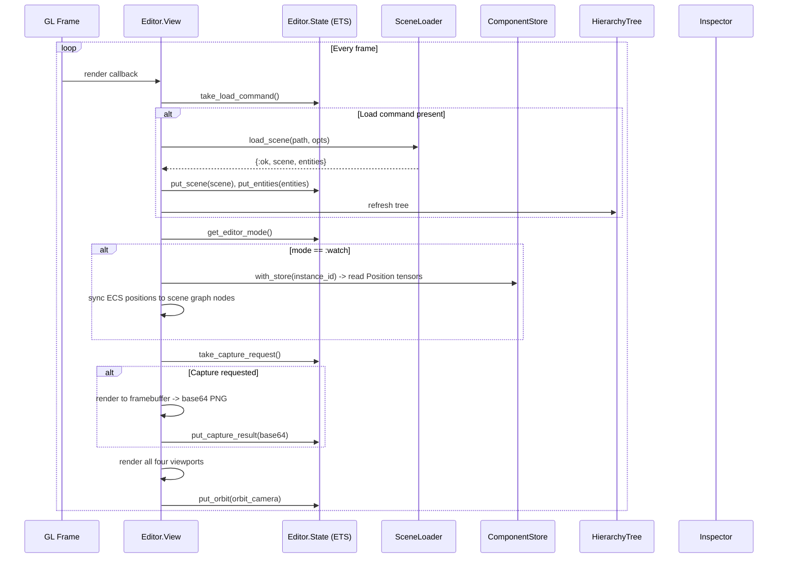
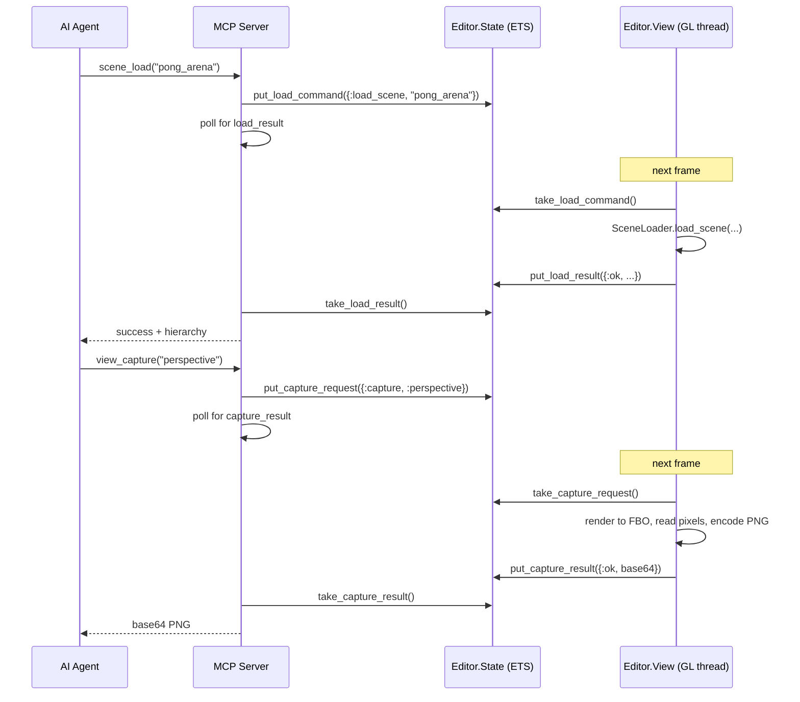
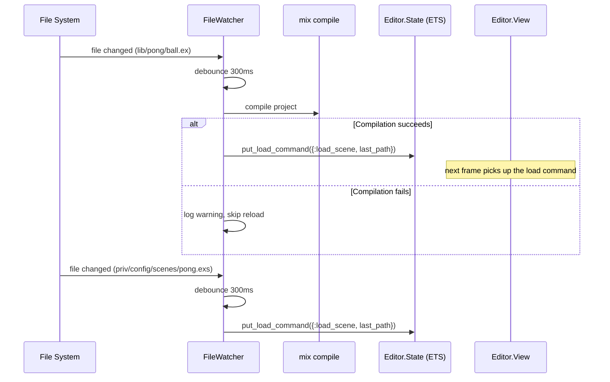

# Editor

The [editor](../concepts.md#editor) provides a native desktop interface for
authoring and debugging Lunity games. It uses wxWidgets for the UI (hierarchy
tree, inspector, transport controls) and [EAGL](../concepts.md#eagl)/OpenGL
for a quad-viewport [scene](../concepts.md#scene) renderer. All editor state
is stored in an [ETS](../concepts.md#ets) table shared between the GL render
thread, the [MCP](../concepts.md#mcp) server, and the file watcher.

## Modules

| Module | File | Role |
|--------|------|------|
| `Lunity.Editor.View` | `lib/lunity/editor/view.ex` | Quad-viewport GL window: renders scenes, processes load/watch/capture/pick commands, syncs ECS to scene |
| `Lunity.Editor.HierarchyTree` | `lib/lunity/editor/hierarchy_tree.ex` | wxTreeCtrl showing game instances and scene nodes; selection triggers inspector updates |
| `Lunity.Editor.Inspector` | `lib/lunity/editor/inspector.ex` | wxGrid displaying component values for the selected entity; supports live watch refresh |
| `Lunity.Editor.State` | `lib/lunity/editor/state.ex` | ETS-backed shared state: scene, orbit camera, load/capture/pick commands, project context, annotations |
| `Lunity.Editor.FileWatcher` | `lib/lunity/editor/file_watcher.ex` | GenServer watching `priv/` and `lib/`; debounces changes and triggers scene reload |
| `Lunity.Editor.Theme` | `lib/lunity/editor/theme.ex` | Reads wxSystemSettings for dark/light mode; provides colours for panels, selection, hover |

## How It Works

### Editor State (ETS)

`Editor.State` is the central coordination point. It stores:

- **Scene data:** current `EAGL.Scene`, scene path, context type (`:scene` or `:prefab`), entities list
- **Camera:** `EAGL.OrbitCamera` state (written by View each frame)
- **Commands:** load, capture, pick, watch, and orbit commands queued by MCP tools
- **Results:** load results, capture results (base64 PNG), pick results
- **Context stack:** push/pop for navigating between scenes and prefabs
- **Project context:** `project_cwd` and `project_app` from `set_project`
- **Visual overlays:** annotations (shapes drawn over the viewport) and highlight_node
- **Game state:** `game_paused` flag, `editor_mode` (`:edit` / `:watch` / `:paused`)
- **Viewport:** current `{width, height}`

All values are read and written via public functions on `Editor.State`.
The ETS table is `:public` so any process (View, MCP, FileWatcher) can
access it without message passing.

### View (quad viewport)

The View is an `EAGL.Window` that renders four orthographic/perspective
viewports in a single GL canvas:

- **Top-left:** top-down (orthographic, Y-axis)
- **Top-right:** perspective (orbit camera)
- **Bottom-left:** front (orthographic, Z-axis)
- **Bottom-right:** right (orthographic, X-axis)

Dividers between viewports are draggable. Mouse events are routed to the
viewport under the cursor.

Each frame, the View:

1. Checks for pending load commands (from MCP or FileWatcher) and executes
   them via `SceneLoader.load_scene/2` or `PrefabLoader.load_prefab/2`
2. Checks for watch commands and syncs ECS positions from ComponentStore
   into the EAGL scene graph
3. Processes capture requests (viewport screenshot to base64 PNG)
4. Processes pick requests (ray-cast to find entity at screen coordinates)
5. Renders the scene in all four viewports
6. Updates the orbit camera and writes it to State

### Hierarchy tree

`HierarchyTree` creates a wxTreeCtrl with two root sections:

- **Game Instances** -- lists running instances from `Lunity.Instance.list/0`
  with entity children from ComponentStore
- **Scenes** -- lists scene nodes from the editor's loaded scene

Selection events update `State` with the selected node/entity, which
triggers the Inspector to refresh. Double-clicking activates a node
(e.g. focus camera).

### Inspector

The Inspector is a wxGrid that shows component values for the selected
entity. It reads component data from the ComponentStore (for instance
entities) or from node properties (for scene nodes). In watch mode, the
inspector refreshes periodically to show live ECS state.

### File watcher

`FileWatcher` monitors:

- `priv/config/`, `priv/scenes/`, `priv/prefabs/` -- `.exs` and `.glb`
  changes trigger immediate scene reload
- `lib/` -- `.ex` changes trigger `mix compile` first, then scene reload

Changes are debounced with a 300ms window (editors often write multiple
times in quick succession). If compilation fails, the reload is skipped
and the old working code stays loaded.

### Theme

`Theme.detect/0` reads wxSystemSettings to determine dark or light mode
and returns a struct with colours for panel backgrounds, selection
highlights, hover states, and text.

## Editor Render Loop

## MCP Command Flow

## File Watcher Flow

## Cross-references

- [Scene and Prefab](02_scene_and_prefab.md) -- View uses SceneLoader and PrefabLoader for loading
- [ECS Core](01_ecs_core.md) -- watch mode syncs ComponentStore positions into the scene graph; Inspector reads component data
- [MCP Tooling](09_mcp_tooling.md) -- all MCP tools communicate with the editor through State
- [Application Lifecycle](11_application_lifecycle.md) -- `mix lunity.edit` starts the editor; Application starts View as a Task
