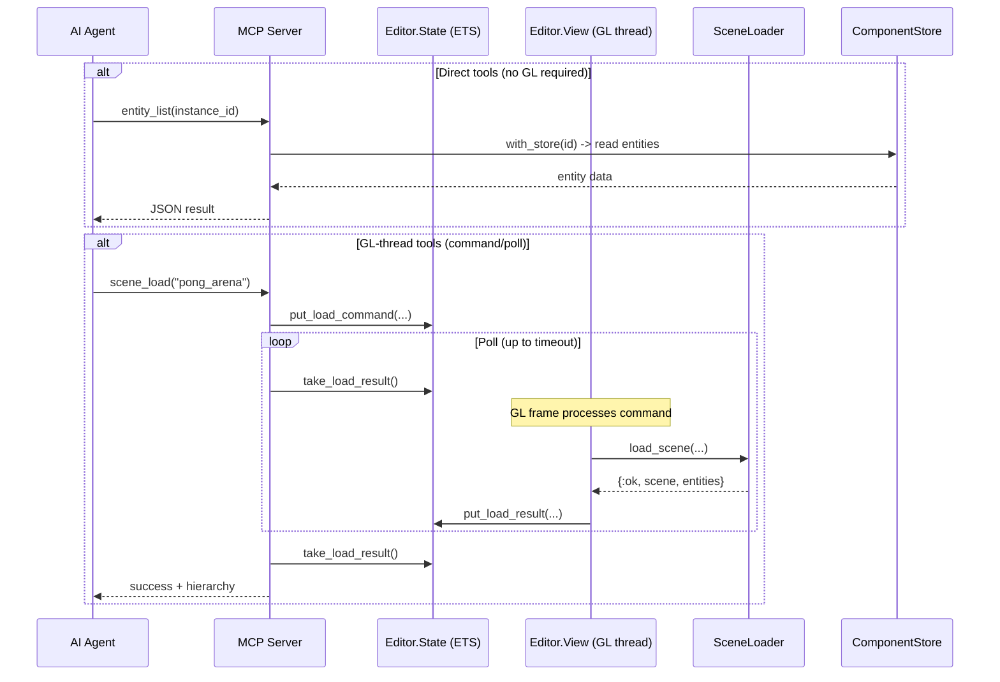
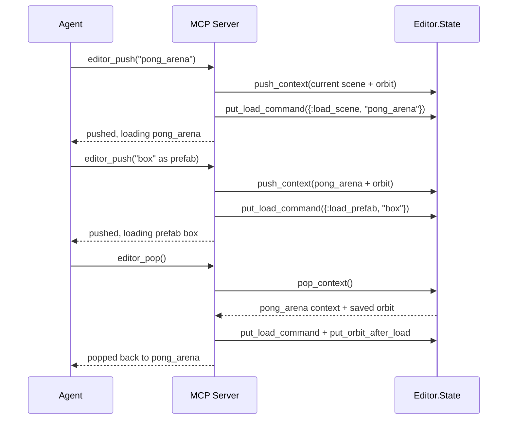

# MCP Tooling

The [MCP](../concepts.md#mcp) (Model Context Protocol) subsystem exposes
Lunity's [editor](../concepts.md#editor) and ECS capabilities to AI agents
(e.g. Cursor). It runs an ExMCP server that provides tools for
[scene](../concepts.md#scene) loading, hierarchy inspection,
[entity](../concepts.md#entity) manipulation, viewport capture,
[instance](../concepts.md#instance) management, and Blender integration.
Tools communicate with the editor through the shared `Editor.State`
[ETS](../concepts.md#ets) table, using a command/poll pattern for operations
that must execute on the GL thread.

## Modules

| Module | File | Role |
|--------|------|------|
| `Lunity.MCP.Server` | `lib/lunity/mcp/server.ex` | ExMCP.Server with tool definitions and `handle_tool_call` dispatch |
| `Lunity.MCP.Server.Setup` | `lib/lunity/mcp/server_setup.ex` | Wraps ExMCP.Server; converts `input_schema` to `inputSchema` (MCP spec camelCase) |
| `Lunity.MCP.Hierarchy` | `lib/lunity/mcp/hierarchy.ex` | Converts EAGL.Scene to a serialisable hierarchy of maps |
| `Lunity.MCP.Viewport` | `lib/lunity/mcp/viewport.ex` | World-to-screen projection and node screen bounds |
| `Lunity.MCP.BlenderExtras` | `lib/lunity/mcp/blender_extras.ex` | Generates Python scripts for Blender custom properties from prefab property specs |

## How It Works

### Server and transport

The MCP server uses ExMCP with HTTP/SSE transport (default) or stdio. In HTTP
mode, it runs alongside the Phoenix endpoint -- the router forwards
`/sse` and `/mcp/v1/sse` paths to ExMCP. In stdio mode, it communicates
directly through standard input/output (has known issues with wx/GL due to
group leader conflicts).

`Server.Setup` wraps `use ExMCP.Server` and adds a `__before_compile__` hook
that converts `input_schema` keys to `inputSchema` (camelCase), as required
by the MCP specification.

### Tool categories

The server exposes tools in several categories:

**Project setup:**
- `set_project` -- set project root and app name for scene resolution
- `project_structure` -- returns the expected `priv/` folder layout

**Scene loading:**
- `scene_load` -- load a scene into the editor
- `scene_get_hierarchy` -- get the current scene as a JSON tree

**Editor context:**
- `editor_get_context` -- current scene path and context type
- `editor_set_context` -- switch to a different scene or prefab
- `editor_push` / `editor_pop` / `editor_peek` -- context stack navigation

**Viewport:**
- `view_capture` -- screenshot a viewport as base64 PNG
- `view_annotate` -- draw overlay shapes (rects, circles, labels)
- `clear_annotations` -- remove overlays
- `camera_state` -- get current orbit camera parameters

**Entity operations:**
- `entity_list` -- list entities in the scene or an instance
- `entity_get` -- get component values for an entity
- `entity_set` -- set component values
- `entity_at_screen` -- find entity at screen coordinates (pick/ray-cast)
- `node_screen_bounds` -- get 2D bounding box for a node
- `highlight_node` -- temporarily highlight a node in the viewport

**Instance management:**
- `instance_snapshot` -- capture full ECS state
- `instance_clone` / `instance_fork` -- create new instance from snapshot
- `run_ticks` / `run_until` -- advance ticks synchronously
- `pause` / `step` / `resume` -- tick control

**Diagnostics:**
- `ecs_dump` -- full ECS state as JSON
- `runtime_info` -- BEAM runtime information
- `gc` -- trigger garbage collection

**Blender:**
- `blender_prefab_properties` -- generate Python script for Blender custom properties

### Command/poll pattern

Operations that require the GL thread (scene loading, viewport capture,
entity picking) follow a command/poll pattern:

1. The MCP tool writes a command to `Editor.State` (e.g.
   `put_load_command`, `put_capture_request`)
2. The tool polls for a result with a timeout
3. The editor View processes the command on the next frame and writes the
   result back to State
4. The MCP tool reads the result and returns it to the agent

This pattern avoids GL context threading issues -- all OpenGL operations
happen on the View's render thread.

### Hierarchy serialisation

`Hierarchy.from_scene/1` walks the EAGL scene graph and produces a list of
maps with `name`, `properties`, `position`, `scale`, and `children`. This
is the standard representation returned by `scene_get_hierarchy` and
included in `scene_load` responses.

### Viewport utilities

`Viewport.world_to_screen/4` projects 3D world coordinates to 2D screen
coordinates using the view and projection matrices.
`node_screen_bounds/3` wraps this to return axis-aligned screen rectangles
for nodes.

### Blender integration

`BlenderExtras.generate_script/1` takes a prefab module name, reads its
property spec via `Lunity.Properties.property_spec/1`, and generates a
Python script that creates matching Blender custom properties on the
selected object. The script includes all metadata: type, default, min/max,
soft limits, step, precision, subtype, and description.

## Tool Execution Flow

## Context Stack Navigation

## Cross-references

- [Editor](08_editor.md) -- MCP tools communicate through Editor.State; View processes commands on the GL thread
- [Web Infrastructure](06_web_infrastructure.md) -- the ExMCP SSE transport is forwarded through the Router; ConnectionReaper manages SSE lifecycle
- [Scene and Prefab](02_scene_and_prefab.md) -- `scene_load` calls SceneLoader; BlenderExtras reads prefab property specs
- [ECS Core](01_ecs_core.md) -- entity_* and instance_* tools read/write ComponentStore and Instance
