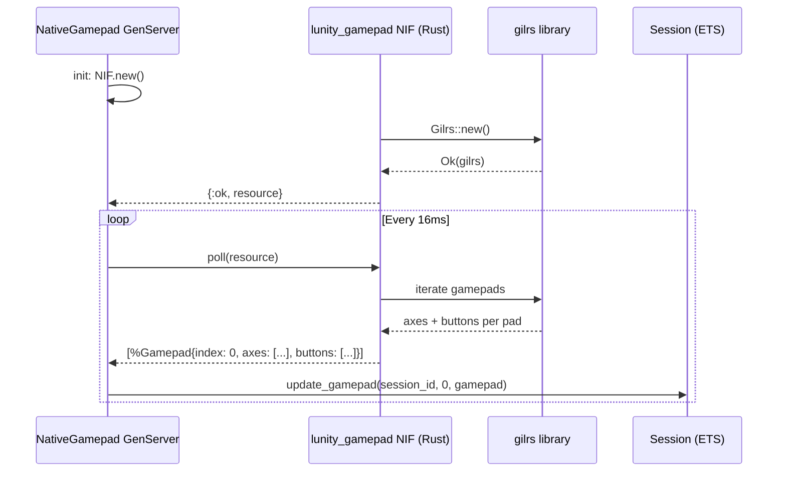
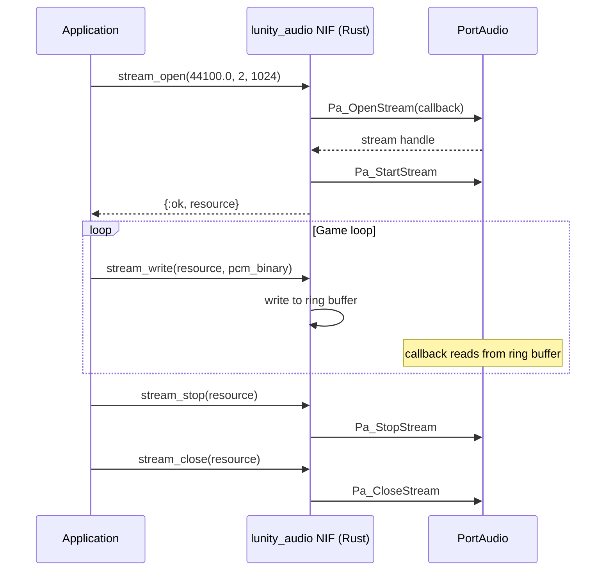

# Native Extensions (Rust NIFs)

Lunity uses three Rustler [NIF](../concepts.md#nif) crates to interface with
native libraries that have no pure-Elixir equivalent: PortAudio for audio
output, gilrs for gamepad input, and the TrackIR SDK for head tracking. Each
crate compiles to a shared library (`.so` / `.dylib` / `.dll`) loaded by the
BEAM at runtime.

## Crates

| Crate | Directory | Elixir Module | Purpose |
|-------|-----------|---------------|---------|
| `lunity_audio` | `native/lunity_audio/` | `Lunity.Audio.Native.Nif` | PCM audio output via PortAudio callback API |
| `lunity_gamepad` | `native/lunity_gamepad/` | `Lunity.Input.NativeGamepad.Nif` | Gamepad polling via gilrs (W3C Gamepad API layout) |
| `lunity_trackir` | `native/lunity_trackir/` | `Lunity.Input.NativeTrackIR.Nif` | TrackIR 6-DOF head tracking (Windows only) |

Built artifacts are placed in `priv/native/` (e.g. `lunity_audio.so`).

## How It Works

### Audio (`lunity_audio`)

Provides PCM audio output using PortAudio's callback API (required for
macOS compatibility where blocking writes cause issues).

**NIF functions:**

| Function | Signature | Description |
|----------|-----------|-------------|
| `stream_open/3` | `(sample_rate, channels, frames_per_buffer) -> {:ok, ref} \| {:error, msg}` | Opens a PortAudio output stream |
| `stream_write/2` | `(ref, binary) -> :ok \| {:error, msg}` | Writes PCM samples to the stream's ring buffer |
| `stream_stop/1` | `(ref) -> {:ok, term} \| {:error, msg}` | Stops the stream |
| `stream_close/1` | `(ref) -> {:ok, term} \| {:error, msg}` | Closes and releases the stream |

The audio subsystem is currently a low-level interface. No higher-level
audio API (sound effects, music, spatial audio) is built on top yet.

### Gamepad (`lunity_gamepad`)

Polls connected gamepads using the gilrs Rust library and returns their
state in a W3C Gamepad API-compatible layout.

**NIF functions:**

| Function | Signature | Description |
|----------|-----------|-------------|
| `new/0` | `() -> {:ok, ref} \| {:error, msg}` | Initialises the gilrs instance |
| `poll/1` | `(ref) -> [%Gamepad{}]` | Returns current state of all connected gamepads |

`NativeGamepad` is a GenServer that calls `poll/1` every 16ms (~60Hz) and
writes each gamepad's state to the input Session ETS table via
`Session.update_gamepad/3`.

The `%Gamepad{}` struct follows the W3C Gamepad API layout:
- `index` -- gamepad index
- `axes` -- list of axis values (-1.0 to 1.0)
- `buttons` -- list of button states (pressed/value)

### TrackIR (`lunity_trackir`)

Interfaces with the NaturalPoint TrackIR SDK (`NPClient64.dll`) on Windows
to provide 6-DOF head tracking data.

**NIF functions:**

| Function | Signature | Description |
|----------|-----------|-------------|
| `init/3` | `(dll_path, developer_id, hwnd) -> {:ok, ref} \| {:error, msg}` | Loads the DLL and registers with TrackIR |
| `poll/1` | `(ref) -> {:ok, %HeadPose{}} \| {:error, msg}` | Reads current head pose |

`NativeTrackIR` is a GenServer that:

1. Checks `os.type()` -- only starts on `{:win32, :nt}`
2. Initialises the NIF with the DLL path, developer ID, and native window
   handle (from `:wxWindow.getHandle/1`)
3. Polls every 16ms and writes `%HeadPose{yaw, pitch, roll, x, y, z, frame}`
   to Session ETS

Returns `{:error, :not_supported}` on non-Windows platforms.

## Gamepad Polling

## Audio Stream Lifecycle

## Cross-references

- [Input](04_input.md) -- NativeGamepad and NativeTrackIR write to Session ETS; the input subsystem provides the GenServer wrappers
- [Application Lifecycle](11_application_lifecycle.md) -- NIFs are loaded via Rustler's `use Rustler` macro when the modules are first called
