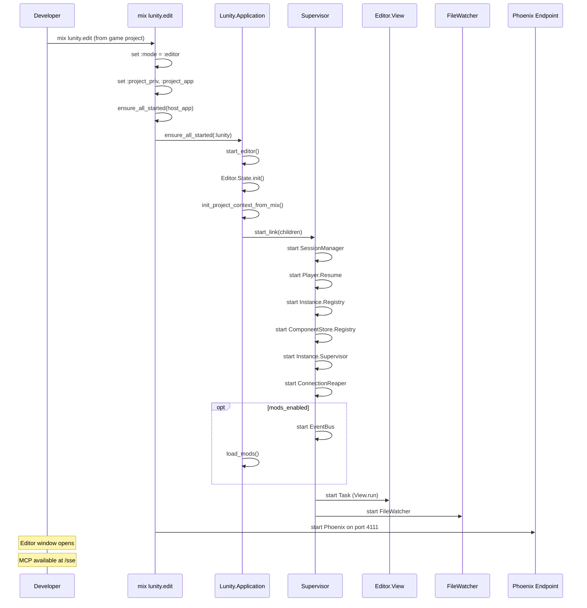
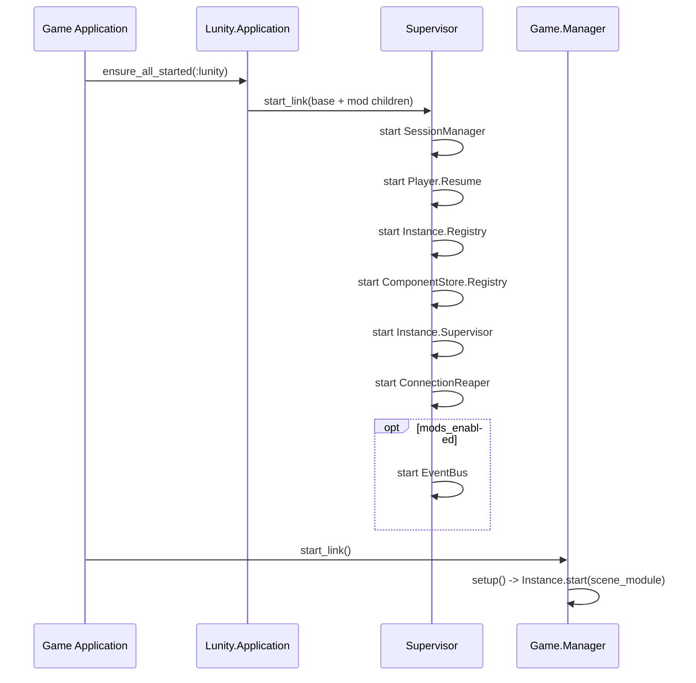

# Application Lifecycle

The application lifecycle subsystem handles OTP application startup, the
supervision tree, [editor](../concepts.md#editor) vs runtime mode selection,
project context resolution, configuration, and the Mix tasks that serve as
entry points. It determines which processes start, how game projects
integrate with the engine, and how configuration flows from config files to
runtime behaviour.

## Modules

| Module | File | Role |
|--------|------|------|
| `Lunity.Application` | `lib/lunity/application.ex` | OTP Application callback; starts editor or runtime supervision tree |
| `Mix.Tasks.Lunity.Edit` | `lib/mix/tasks/lunity.edit.ex` | Starts the editor with MCP server (Phoenix HTTP or stdio) |
| `Mix.Tasks.Lunity.Player` | `lib/mix/tasks/lunity.player.ex` | Headless WebSocket client for testing the player protocol |
| `Mix.Tasks.Lunity.PlayerWindow` | `lib/mix/tasks/lunity.player_window.ex` | wx window displaying live ECS state from a WebSocket connection |

## How It Works

### Application modes

Lunity runs in one of two modes, determined by
`Application.get_env(:lunity, :mode)`:

**Editor mode (`:editor`):**
- Initialises `Editor.State` (ETS)
- Resolves project context from Mix (`:project_priv`, `:project_app`)
- Starts base children, mod children, the editor View (as a Task), and
  the FileWatcher
- When the View window closes, the application stops after a 300ms delay

**Runtime mode (default):**
- Starts only the base and mod children under a Supervisor
- No editor UI, no FileWatcher
- Used when Lunity is a dependency in a game project running as a server

### Supervision tree

```
Supervisor (one_for_one)
├── Lunity.Input.SessionManager        # owns :lunity_input ETS table (see Sessions concept)
├── Lunity.Player.Resume               # reconnect grace window
├── Registry (Lunity.Instance.Registry)    # maps instance IDs to PIDs
├── Registry (Lunity.ComponentStore.Registry)  # maps store IDs to PIDs
├── DynamicSupervisor (Lunity.Instance.Supervisor)  # hosts Instance GenServers
├── Lunity.Web.ConnectionReaper        # SSE connection lifecycle
├── Lunity.Mod.EventBus               # (only if :mods_enabled)
├── Task (Editor.View.run)             # (only in editor mode)
└── Lunity.Editor.FileWatcher          # (only in editor mode)
```

Each `Lunity.Instance` ([concept](../concepts.md#instance)) is started as a
temporary child of the DynamicSupervisor, with its own
[ComponentStore](../concepts.md#componentstore) GenServer registered in the
ComponentStore.Registry.

### Project context

When Lunity is used as a dependency (the normal case), it needs to know
which game project it is serving:

- **`:project_priv`** -- path to the game's `priv/` directory (for scenes,
  prefabs, config)
- **`:project_app`** -- the game's application atom (e.g. `:pong`)

These are set by `mix lunity.edit` before starting the application. At
runtime, `Lunity.project_app/0` resolves the app from (in order):

1. Editor.State ETS (`:project_app`)
2. Process dictionary (`:lunity_project_app`, used by MCP)
3. Application config (`:project_app`)
4. Mix.Project (when available)

### Configuration

Configuration is split across `config/` files:

**`config.exs` (base):**
- Logger level
- Player/WebSocket settings:
  - `:player_ws_token` -- transport handshake secret
  - `:player_jwt_secret` -- JWT signing key
  - `:player_mint_secret` -- mint endpoint access key
  - `:player_state_push_interval_ms` -- state push frequency (default 100ms)
  - `:player_reconnect_grace_ms` -- resume grace window (default 10s)
  - `:player_join` -- optional `{Module, :function}` for server-assigned join

**`dev.exs`:**
- Dev-only secrets for `player_ws_token`, `player_jwt_secret`,
  `player_mint_secret`

**`test.exs`:**
- Minimal; tests use `Application.put_env` in setup blocks

### Mix tasks

**`mix lunity.edit`:**
1. Sets `NSRequiresAquaSystemAppearance` on macOS (for dark mode)
2. Resolves project directory from `--project` or `LUNITY_PROJECT`
3. Sets `:mode` to `:editor`, `:project_priv`, `:project_app`
4. Ensures the host game app is started (e.g. `:pong`)
5. Starts Lunity (triggers `Application.start/2` in editor mode)
6. Starts Phoenix endpoint on port 4111 (default) for MCP HTTP/SSE
7. Logs to `tmp/lunity_edit.log` (logger backends disabled for stdio
   compatibility)

**`mix lunity.player`:**
1. Compiles and loads config only (no `app.start`)
2. Starts only Req and WebSockex
3. Connects to the game server's PlayerSocket using the full protocol
4. Supports `--jwt`, `--mint-key`, `--user-id`, `--hints`, `--resume`,
   `--auth-only`, `--skip-followup`, `--verbose`
5. Outputs the protocol transcript; useful for testing auth and join

**`mix lunity.player_window`:**
- Opens a wx window that connects as a player and displays live ECS
  state (pretty-printed JSON), updating on each `state` push

## Application Startup (Editor Mode)



## Application Startup (Runtime Mode)



## Cross-references

- [ECS Core](01_ecs_core.md) -- Instance.Supervisor and ComponentStore.Registry are started here
- [Input](04_input.md) -- SessionManager is started in the supervision tree
- [Player Protocol and Auth](05_player_protocol_and_auth.md) -- Player.Resume is started here; `mix lunity.player` tests the protocol
- [Web Infrastructure](06_web_infrastructure.md) -- Phoenix Endpoint is started by `mix lunity.edit`
- [Mod System](07_mod_system.md) -- EventBus is started when `:mods_enabled`; `load_mods/0` runs during startup
- [Editor](08_editor.md) -- View and FileWatcher are started in editor mode
